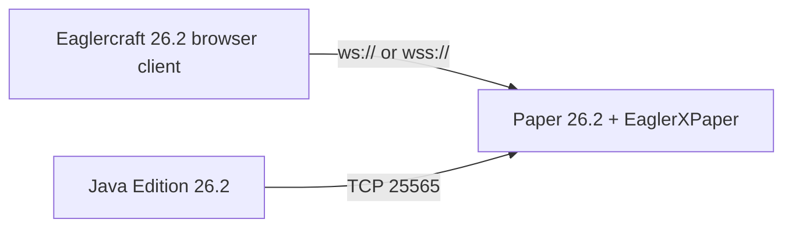

# Plan: host Eaglercraft 26.2 from this repo

This repository adds a **one-folder Paper 26.2 stack** with a WebSocket-capable plugin so browser clients can join the same world as Java 26.2 players.

## Architecture

| Piece | Role |
|-------|------|
| **Paper 26.2** | Official Minecraft 26.2 server software |
| **EaglerXPaper** | Fork of lax1dude’s EaglerXServer for Paper 1.17+ through 26.x; shares port 25565 and detects WebSocket vs vanilla TCP |
| **This repo’s launchers** | Download jars, accept EULA template, start Java with sane memory flags |

### What this is *not*

- It does **not** bundle the Eaglercraft 26.2 **client** (WASM/HTML). You still launch the client from your own offline HTML or a community build.
- It is **not** the old BungeeCord + EaglercraftXBungee tutorial used for 1.8 / 1.12. That path does not match native 26.2 protocol clients.

### Client compatibility note

Community **26.2 WASM** builds are still experimental. Most should work with **EaglerXPaper** on Paper 26.2 because the backend runs real 26.2. If a specific client build fails, try another 26.2 HTML build or check that it targets the same protocol as your Paper version.

## Implementation checklist (this repo)

- [x] `launch/manifest.json` — pinned Paper build + EaglerXPaper release URLs and checksums
- [x] `launch/setup.py` — cross-platform bootstrap (Java 25 check, downloads, `eula.txt`, `server.properties`)
- [x] `launch/start-server.sh` — Linux/macOS start
- [x] `launch/start-server.bat` / `start-server.cmd` — Windows CMD start (double-click `.cmd`)
- [x] `launch/tunnel-ngrok.bat` — optional public `wss://` via ngrok
- [x] README section — requirements, setup, join instructions
- [ ] Optional future: Velocity front-end for multi-server networks (use upstream EaglerXServer on Velocity, not EaglerXPaper)

## User workflow

1. Install **Java 25+** (Temurin recommended).
2. Run setup once: `python launch/setup.py`
3. Start server:
   - **Windows:** double-click `launch/start-server.cmd` or run `launch\start-server.bat`
   - **Linux/macOS:** `./launch/start-server.sh`
4. In Eaglercraft 26.2: **Multiplayer → Direct Connect** → `ws://127.0.0.1:25565/`
5. For online play: port-forward **25565** or run `launch/tunnel-ngrok.bat` and use the printed `wss://…` URL (online hosted clients often require HTTPS/WSS).

## Turning `.bat` into a `.exe` (optional)

Windows does not ship a `.exe` in git (build artifact). To make one locally:

- Use [Bat To Exe Converter](https://www.battoexeconverter.com/) or similar on `launch/start-server.cmd`, **or**
- Create a shortcut to `start-server.cmd` and pin it to Start.

The `.cmd` / `.bat` files are the supported launcher; behavior is identical.

## Requirements

| Resource | Minimum |
|----------|---------|
| RAM | 4 GB system (2G–4G heap default in manifest) |
| Disk | ~10 GB after world generation |
| Java | 25+ for Paper 26.2 |
| Network | TCP 25565 (+ TLS terminator if using `wss://`) |
